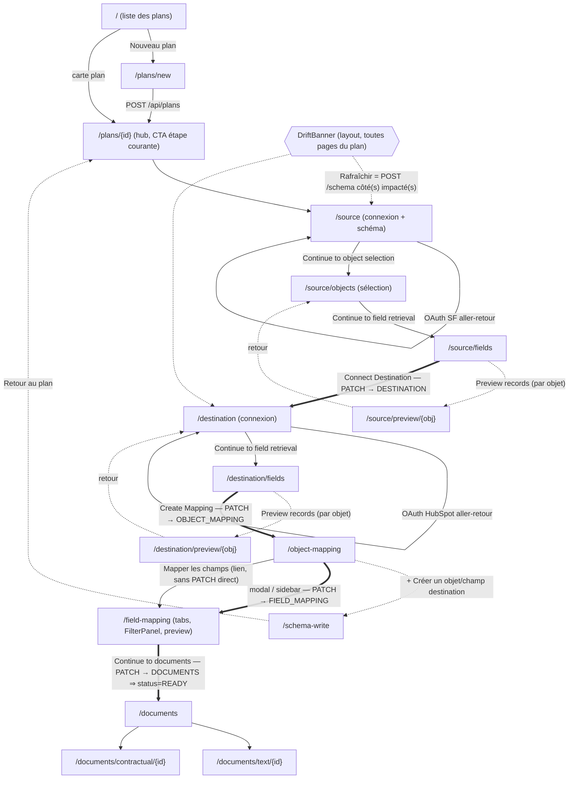

# 01 — Graphe de navigation et parcours guidé

> **Statut** : document de fondation v5. **Source de vérité : le code v4 récupéré** (worktree
> `keen-matsumoto-22c856`, validé en recette réelle SF→HubSpot). Chaque affirmation de câblage
> cite le fichier v4 d'origine. En cas de conflit avec les specs archivées (`specs/001-*`,
> `002`, `004`, `006`), ce document — donc le code v4 — fait foi.
>
> **Pourquoi ce document existe** : ce savoir n'avait jamais été écrit. Les régénérations v4
> ont produit des pages riches **construites mais pas câblées** (orphelines), un stepper qui
> court-circuitait les sous-parcours, et un plan qui ne devenait jamais READY. Les commits de
> câblage `ec038be2`, `0127e1ea`, `fb767f97`, `cf7f2898`, `eaf387dd`, `f246f8ab`, `225418ed`
> ont réparé cela a posteriori. La v5 doit câbler dès la construction.

---

## 1. Le parcours guidé principal

### 1.0 Structure persistante (toutes les pages de plan)

Toutes les routes `/plans/{planId}/**` sont enveloppées par un layout fixe `h-screen` :
`PlanHeader` (nom du plan cliquable → `/plans/{planId}`, badge statut FR Brouillon/Prêt/Erreur,
pastilles connecteurs source → destination, lien « ← Plans » vers `/`), puis `DriftBanner`
(non bloquant), puis `StepSidebar` à gauche + `<main>` scrollable
(v4: `src/app/plans/[planId]/layout.tsx`, `src/features/plans/components/plan-header.tsx`).
Le layout monte aussi `PlanDriftProvider` qui possède l'état de drift de la visite (§4.5).

La sidebar affiche les 5 étapes (`Workflow`) + un bouton « étape suivante » épinglé en bas
(v4: `src/features/plans/components/step-sidebar.tsx`). Règles de gating : §3.

### 1.1 Home — liste des plans

- **URL** : `/`
- **Rend** : `PlanList` — titre « Plans de migration », bouton « Nouveau plan » → `/plans/new`,
  grille de `PlanCard` (une carte = lien vers le plan + suppression), état vide avec CTA
  « Créer un plan » (v4: `src/app/page.tsx`, `src/features/plans/components/plan-list.tsx`).
- **Sortie** : clic sur une carte → `/plans/{planId}` ; « Nouveau plan » → `/plans/new`.
- **Effet d'état** : aucun.

### 1.2 Création de plan

- **URL** : `/plans/new`
- **Rend** : `PlanForm` — champs nom (requis) + description, `POST /api/plans`, puis
  `router.push('/plans/{id}')` (v4: `src/features/plans/components/plan-form.tsx`).
- **Effet d'état** : plan créé avec `status=DRAFT`, `currentStep=SOURCE` (défauts Prisma ;
  v4: `src/features/plans/services/plan-service.ts` `createPlan`).

### 1.3 Détail du plan (hub, jamais de redirect)

- **URL** : `/plans/{planId}`
- **Rend** : métadonnées + `DeletePlanDialog` + section « Étape actuelle » : description FR de
  l'étape courante et un CTA unique vers `STEP_PATHS[currentStep]`. **Ne redirige PAS**
  (learning de session v4 : le workflow vit dans la sidebar, pas dans un redirect)
  (v4: `src/app/plans/[planId]/page.tsx`).
- **Sortie** : CTA « Configurer la source / … » → page de l'étape courante.

### 1.4 Source — connexion + schéma

- **URL** : `/plans/{planId}/source` (étape `SOURCE`)
- **Rend** : `SourceConnectionPage` (v4: `src/features/source-connection/components/source-connection-page.tsx`) :
  - Non connecté : choix d'adaptateur. `salesforce` → redirect OAuth
    `/api/connectors/salesforce/auth?planId=…` (HubSpot filtré : destination-only). `demo` →
    `POST /api/plans/{planId}/source`.
  - Le callback OAuth crée la `ConnectorConnection`, la lie au plan
    (`sourceConnectionId`) et redirige vers `/plans/{planId}/source?connected=salesforce`
    (v4: `src/app/api/connectors/salesforce/callback/route.ts`).
  - Connecté : carte connexion (badge statut, « Refresh Schema », « Disconnect »),
    **auto-fetch du schéma si connecté sans snapshot** (retour OAuth typique — §4.1),
    `SchemaDiffView` après un refresh si drift.
- **Sortie** : carte « ✓ N objects discovered » + bouton **« Continue to object selection → »**
  → `/plans/{planId}/source/objects` (câblé par commit `ec038be2` — avant, la page sautait
  directement à destination).
- **Effet d'état** : aucun PATCH de step (on reste dans l'étape SOURCE). `POST /source/schema`
  fait rotation de snapshot + integrity + diff (§4.4).

### 1.5 Sélection d'objets source (sous-parcours SOURCE)

- **URL** : `/plans/{planId}/source/objects` (étape `SOURCE`)
- **Rend** (v4: `src/app/plans/[planId]/source/objects/page.tsx`,
  `src/features/schema/components/object-selection-list.tsx`,
  `src/features/schema/hooks/use-object-selection.ts`) :
  - Recherche temps réel (apiName + label + description).
  - Filtre segmenté **Tous / Sélectionnés / Non sélectionnés** (commit `225418ed` — recette
    réelle : 635 → 12 objets).
  - `SelectionToolbar` : compteur « X selected of Y objects (Z custom) », toggle
    **Show/Hide system (N)**, **Select all / Deselect all** (portée = objets visibles selon le
    toggle système) (v4: `src/features/schema/components/selection-toolbar.tsx`).
  - Toggle unitaire optimiste avec revert (`PUT /source/objects`), panneau expand par objet.
  - Lien retour « ← Back to source » ; état vide → lien vers `/source` pour récupérer le schéma.
- **Pré-sélection par défaut** : au premier `GET /source/objects`, `initDefaultSelection` crée
  les lignes `ObjectSelection` avec `isSelected = isCustom OR apiName ∈ commonBusinessObjects`
  (liste unifiée `DEFAULT_CRM_OBJECTS`, commit `f246f8ab`). Catégorisation
  custom/business/system par préfixes **et suffixes** (SF: Feed, History, Share, ChangeEvent,
  Tag), tri custom < business < system
  (v4: `src/features/schema/services/object-selection-service.ts`,
  `src/app/api/plans/[planId]/source/objects/route.ts`).
- **Sortie** : lien **« Continue to field retrieval → »** → `/plans/{planId}/source/fields`.
- **Effet d'état** : aucun PATCH (toujours SOURCE). Persistance = lignes `ObjectSelection`.

### 1.6 Champs source (sous-parcours SOURCE) — FRONTIÈRE 1

- **URL** : `/plans/{planId}/source/fields` (étape `SOURCE`)
- **Rend** (v4: `src/app/plans/[planId]/source/fields/page.tsx`) :
  - **Auto-retrieve à la première arrivée** si 0 champ (ref-guard, une seule fois — §4.2).
  - Bouton « Retrieve fields / Re-retrieve fields », `FieldRetrievalProgress`.
  - Stats : N objects, M total fields, X inaccessible.
  - `ObjectFieldAccordion` par objet avec lien **« Preview records »** →
    `/plans/{planId}/source/preview/{objectApiName}` (câblé par `eaf387dd`).
- **Scope** : `POST /source/fields` récupère les champs **uniquement des objets SÉLECTIONNÉS**
  (`getSelectedObjectNames` ; 400 si aucune sélection)
  (v4: `src/app/api/plans/[planId]/source/fields/route.ts`).
- **Sortie** : encart « Source schema ready. » + bouton **« Connect Destination → »** →
  `await recordStep(planId, 'DESTINATION')` puis `router.push('/destination')`.
- **Effet d'état** : **PATCH currentStep → `DESTINATION`** (frontière 1, commit `0127e1ea`).

### 1.7 Destination — connexion + schéma

- **URL** : `/plans/{planId}/destination` (étape `DESTINATION`)
- **Rend** : `DestinationConnectionPage`
  (v4: `src/features/destination-connection/components/destination-connection-page.tsx`) —
  miroir de la source : `hubspot` → OAuth `/api/connectors/hubspot/auth?planId=…`
  (Salesforce filtré : source-only), `demo` → POST ; auto-fetch schéma si connecté sans
  snapshot ; Refresh Schema / Disconnect ; `SchemaDiffView` après refresh.
- **Sortie** : carte « ✓ N destination objects discovered » + bouton
  **« Continue to field retrieval → »** → `/plans/{planId}/destination/fields`.
- **Effet d'état** : aucun PATCH. **Pas de sous-parcours de sélection d'objets côté
  destination** : tous les objets destination sont conservés.

### 1.8 Champs destination — FRONTIÈRE 2

- **URL** : `/plans/{planId}/destination/fields` (étape `DESTINATION`)
- **Rend** : identique à 1.6 (auto-retrieve au premier passage, stats, accordion,
  « Preview records » → `/destination/preview/{obj}`)
  (v4: `src/app/plans/[planId]/destination/fields/page.tsx`).
- **Scope** : `POST /destination/fields` récupère les champs de **TOUS** les objets
  destination (pas de sélection) (v4: `src/app/api/plans/[planId]/destination/fields/route.ts`).
- **Sortie** : encart « Destination schema ready (N objects, M fields). Next: Create Mapping »
  + bouton **« Create Mapping → »** → `await recordStep(planId, 'OBJECT_MAPPING')` puis
  `router.push('/object-mapping')`.
- **Effet d'état** : **PATCH currentStep → `OBJECT_MAPPING`** (frontière 2).

### 1.9 Object mapping — FRONTIÈRE 3

- **URL** : `/plans/{planId}/object-mapping` (étape `OBJECT_MAPPING`)
- **Rend** (v4: `src/features/object-mapping/components/ObjectMappingView.tsx`,
  `object-mapping-page.tsx`, `hooks/useObjectMappings.ts`) :
  - Deux colonnes : objets source (**seulement les sélectionnés** : filtre
    `isSelected !== false`) / objets destination, chacune avec recherche + filtre
    (all/mapped/unmapped/standard/custom) et compteurs.
  - Liens SVG entre paires mappées (suppression via le lien → AlertDialog « cascade champs +
    règles + filtres »).
  - Création : clic cercle source → clic cercle destination (`POST /object-mappings`,
    warning fan-in surfacé).
  - **Auto-link au premier chargement** si `objectAutoLinkedAt` est null (§4.3).
  - Modal détail par carte (`useMappingStats` : stats live — compteurs record/champs/filtres)
    avec action « aller au field mapping » → `recordStep(planId, 'FIELD_MAPPING')` puis
    `router.push('/field-mapping?object={apiName}')`.
  - Bouton **« + Créer un objet/champ destination »** dans la barre de statut →
    `/plans/{planId}/schema-write` (câblé par `eaf387dd`).
  - Liste récapitulative des mappings avec lien **« Mapper les champs → »** →
    `/field-mapping?object={source}` (simple `<a>`, **sans** recordStep — couvert par le
    high-water-mark de la sidebar, §3.3).
- **Effet d'état** : **PATCH currentStep → `FIELD_MAPPING`** (frontière 3, via la modal ou via
  la sidebar).

### 1.10 Field mapping — FRONTIÈRE 4

- **URL** : `/plans/{planId}/field-mapping` (étape `FIELD_MAPPING`)
- **Rend** (v4: `src/features/field-mapping/components/field-mapping-page.tsx`,
  `field-mapping-view.tsx`, `hooks/use-field-mapping.ts`) :
  - Tabs par paire d'objets avec `TabBadge` (mappés/total + alerte si linkStatus
    RED_SOLID/RED_DASHED/BROKEN).
  - Par paire : compteur « X mappés · Y non mappés », `UnmappedFieldsWarning`
    (exclure / ré-inclure un champ), `FieldMappingView` (recherche temps réel, création de
    lien avec 409 doublon géré, suppression optimiste, bouton auto-match manuel).
  - **`FilterPanel`** (filtres de migration + estimation du nombre d'enregistrements —
    ré-estimée à chaque create/delete/toggle) sous la table
    (v4: `src/features/filters/components/filter-panel.tsx` ; était orphelin avant le
    câblage « cluster 12 », cf. commentaire dans `field-mapping-page.tsx`).
  - `MigrationPreviewPanel` en aside sticky (aperçu temps réel des records transformés).
  - **Auto-match au premier mount** si 0 mapping (§4.3).
  - Bouton « Objet suivant : … → » pour enchaîner les paires.
- **Sortie** : bouton **« Continue to documents → »** → `await recordStep(planId, 'DOCUMENTS')`
  puis `router.push('/documents')`.
- **Effet d'état** : **PATCH currentStep → `DOCUMENTS`**, ce qui met aussi `status=READY`
  (frontière 4 ; v4: `src/features/plans/services/plan-service.ts` `advanceStep`).

### 1.11 Documents — plan READY

- **URL** : `/plans/{planId}/documents` (étape `DOCUMENTS`)
- **Rend** (v4: `src/features/documents/components/documents-page.tsx`) :
  - « Description du plan » (018) : « Générer la description » (template) / « Générer avec
    IA » (LLM), rendu inline `PlanDescriptionView`.
  - Documents techniques (019) et contractuels (020) : génération, liste versionnée, liens
    vers `/documents/text/{documentId}` et `/documents/contractual/{documentId}` (aperçu +
    export PDF via les routes `…/pdf`).
- **Effet d'état** : aucun PATCH supplémentaire — l'arrivée ici suppose
  `currentStep=DOCUMENTS`, donc `status=READY` (badge « Prêt » dans le header).

---

## 2. Graphe de navigation (avec embranchements optionnels)

Légende : `==>` = frontière d'étape (PATCH currentStep) ; `-.->` = embranchement optionnel
(record preview, schema-write, drift) ; `-->` = navigation sans effet d'état.

---

## 3. Règles de frontière d'étape (NORMATIF)

### 3.1 Enum ordonné

`PLAN_STEPS = ['SOURCE', 'DESTINATION', 'OBJECT_MAPPING', 'FIELD_MAPPING', 'DOCUMENTS']`
(v4: `src/features/plans/lib/steps.ts`). Toute comparaison passe par l'index dans ce tableau.
`normalizeStep` mappe les valeurs legacy (SOURCE_CONNECTION→SOURCE, OBJECT_SELECTION→SOURCE,
DESTINATION_CONNECTION→DESTINATION, MAPPING→OBJECT_MAPPING, RUN→DOCUMENTS).

### 3.2 advanceStep : forward-only côté API

`PATCH /api/plans/{planId}/step { targetStep }` → `advanceStep` refuse (throw → **422**) tout
target qui n'est pas strictement en avant de `currentStep`
(v4: `src/app/api/plans/[planId]/step/route.ts`, `plan-service.ts`). Côté client, le helper
`recordStep` **avale toute erreur** (422 « déjà à/au-delà » comme les erreurs réseau) et la
navigation se fait quoi qu'il arrive (v4: `src/features/plans/lib/record-step.ts`).
`advanceStep(…, 'DOCUMENTS')` met aussi `status='READY'` dans le même update.

### 3.3 Gating du stepper = high-water-mark

`reachedIdx = max(index(currentStep persisté), index(étape de la page ouverte))`
(v4: `src/features/plans/components/step-sidebar.tsx`, commit `fb767f97`). Conséquences :

- Toute étape d'index ≤ `reachedIdx` est cliquable (`<Link>`) ; au-delà : verrouillée (div).
- **Navigation arrière toujours permise** vers les étapes déjà atteintes, **sans
  reverrouillage** : si la page ouverte est en avance sur `currentStep`, un `useEffect`
  PATCHe `/step` pour **persister** le high-water-mark (une fois par étape active, 422 bénin
  avalé). Revenir en arrière ne re-verrouille donc jamais l'avant.
- Le bouton « étape suivante » (bas de sidebar) ne PATCHe que si la page active est **à la
  frontière** (`index(activePage) >= currentMaxIdx`), puis `router.push` ; sur une étape déjà
  validée il navigue sans PATCH.

### 3.4 Les 4 frontières qui PATCHent currentStep

| # | D'où | Bouton | targetStep | Fichier v4 |
|---|------|--------|-----------|------------|
| 1 | `/source/fields` | « Connect Destination → » | `DESTINATION` | `src/app/plans/[planId]/source/fields/page.tsx` |
| 2 | `/destination/fields` | « Create Mapping → » | `OBJECT_MAPPING` | `src/app/plans/[planId]/destination/fields/page.tsx` |
| 3 | `/object-mapping` | modal détail « field mapping » | `FIELD_MAPPING` | `src/features/object-mapping/components/ObjectMappingView.tsx` |
| 4 | `/field-mapping` | « Continue to documents → » | `DOCUMENTS` | `src/features/field-mapping/components/field-mapping-page.tsx` |

(+ le filet de sécurité sidebar : PATCH du high-water-mark à l'ouverture d'une page en avance,
et PATCH du bouton « suivant » à la frontière — §3.3.) Sans ces PATCH, `advanceStep` étant
forward-only et READY exigeant `currentStep=DOCUMENTS`, **le plan ne devenait jamais READY**
(commit `0127e1ea`, cause racine du mode d'échec v4).

### 3.5 Statut du plan (DRAFT / READY / BROKEN)

- `READY` est atteint quand `advanceStep` passe `currentStep` à `DOCUMENTS`
  (v4: `plan-service.ts`).
- `checkIntegrity` (v4: `src/features/integrity/services/integrity-service.ts`) recalcule le
  statut : issues non résolues > 0 → **BROKEN** ; sinon si `currentStep=DOCUMENTS` **et**
  statut déjà READY → READY préservé ; sinon → DRAFT. Il ne **promeut** jamais vers READY.
- Toute rupture (mapping cassé après drift : BROKEN_REFERENCE, INCOMPATIBLE_TYPE,
  UNMAPPED_REQUIRED_FIELD, INVALID_FILTER) → `status=BROKEN` ; la réparation
  (`repairBrokenMappings`, jamais automatique — Principe IX) ou la résolution manuelle
  re-déclenche le recalcul.

---

## 4. Effets de bord automatiques

### 4.1 Auto-fetch du schéma à la connexion (source ET destination)

Si la page de connexion trouve une connexion **sans snapshot CURRENT** (cas typique : retour
OAuth), elle lance automatiquement `POST /{side}/schema` — la récupération n'est pas une étape
manuelle zappable (commit `cf7f2898` ; v4: `source-connection-page.tsx` `loadSchemaAndObjects`,
`destination-connection-page.tsx` `loadSchema`). Stratégie : 1re connexion → auto ; revisite →
cache ; bouton « Refresh Schema » → re-fetch manuel.

### 4.2 Auto-retrieve des champs à la première arrivée

Les pages `/source/fields` et `/destination/fields` déclenchent `POST /{side}/fields` si aucun
champ n'a encore été récupéré (ref-guard `autoRetrievedRef`, une fois par mount)
(v4: `src/app/plans/[planId]/source/fields/page.tsx`, `destination/fields/page.tsx`).
**Scope** : source = objets sélectionnés uniquement (`getSelectedObjectNames`) ; destination =
tous les objets (v4: routes `api/plans/[planId]/{source,destination}/fields/route.ts`).

### 4.3 Auto-link objets et auto-match champs (Principe IX : jamais ré-exécutés en silence)

- **Auto-link** : au premier chargement de `/object-mapping`, le client POSTe
  `/object-mappings/auto-link` **seulement si** `plan.objectAutoLinkedAt` est null ; le serveur
  est lui-même gated (no-op `alreadyLinkedAt` si non-null) et pose le timestamp dans la même
  transaction que la création des paires
  (v4: `src/features/object-mapping/hooks/useObjectMappings.ts`,
  `services/object-mapping-service.ts`, `api/.../object-mappings/auto-link/route.ts`).
- **Auto-match** : au premier mount d'une paire dans `/field-mapping`, si 0 field-mapping, le
  client POSTe `{ autoMatch: true }` ; le serveur retourne `{created:0,skipped:0}` si
  `objectMapping.fieldAutoMatchedAt` est déjà posé, et pose le timestamp sinon
  (v4: `src/features/field-mapping/hooks/use-field-mapping.ts`,
  `services/field-mapping-service.ts` — garde ligne ~409). Le bouton auto-match manuel reste
  disponible.

### 4.4 Refresh de schéma = chaîne complète

`POST /{side}/schema` : fetch adaptateur → **rotation snapshot** (CURRENT→PREVIOUS, nouveau
CURRENT) → **`checkAndUpdatePlanStatus`** (re-run integrity : le plan bascule vers/depuis
BROKEN, issues upsertées/auto-résolues) → `computePersistedDrift` retourné dans la réponse
`{ snapshot, driftReport }` pour afficher « ce qui a changé »
(v4: `src/app/api/plans/[planId]/source/schema/route.ts`, idem destination).
`checkAndUpdatePlanStatus` est aussi appelé après chaque CRUD d'object/field-mapping.

### 4.5 Vérification de drift à la visite du plan

`PlanDriftProvider` (monté dans le layout) fire `GET /{side}/schema/diff` pour les côtés
connectés, **une fois par visite de plan** (gating `sessionStorage.lastVisitedPlanId`), merge
les deux rapports et les expose par contexte. `DriftBanner` s'affiche si drift
critique/warning : « Rafraîchir le schéma » = POST `/schema` du/des côté(s) impacté(s) puis
re-check (auto-dismiss si propre) ; « Ignorer » = scoped `planId+checkedAt` en sessionStorage
(réapparaît au prochain rapport) (v4: `src/features/plans/plan-drift-context.tsx`,
`src/features/schema/components/drift-banner.tsx`).

---

## 5. Anti-régressions de câblage (à ne JAMAIS reproduire)

Chaque ligne = un orphelinage réellement constaté en v4 (ou hérité de v3), réparé par le
commit cité. Un port v5 qui reproduit l'un de ces états est un échec d'implémentation.

1. `/source` sautait directement à `/destination`, court-circuitant tout le sous-parcours
   `/source/objects` → `/source/fields` (recherche, toggle système, compteurs inaccessibles)
   — il manquait le bouton « Continue to object selection » (`ec038be2`).
2. `/destination` avait sa propre liste basique dupliquée et avançait direct — il manquait
   « Continue to field retrieval » → `/destination/fields` (`0127e1ea`).
3. `/field-mapping` était un cul-de-sac : aucun « Continue to documents » (`0127e1ea`).
4. Aucune frontière ne PATCHait `currentStep` → forward-only + READY-à-DOCUMENTS = **le plan
   ne devenait jamais READY** ; il manquait `recordStep` aux 4 frontières (`0127e1ea`).
5. Le stepper gatait sur le seul `currentStep` persisté → étapes pourtant atteintes
   verrouillées au retour arrière ; il manquait le high-water-mark
   `max(currentStep, page ouverte)` + sa persistance (`fb767f97`).
6. `/source/fields` était zappable via la sidebar → 0 champ récupéré → « Aucun champ
   disponible » en field-mapping ; il manquait l'auto-fetch schéma+champs à la connexion et à
   la première arrivée (`cf7f2898`).
7. `/schema-write` n'avait **aucun lien entrant** (déjà orphelin en v3) ; il manquait le bouton
   « + Créer un objet/champ destination » dans object-mapping (`eaf387dd`).
8. Les pages record preview (`/{side}/preview/{obj}`) n'avaient aucun lien entrant ; il
   manquait « Preview records » par objet dans l'accordion des pages fields (`eaf387dd`).
9. `FilterPanel` (filtres de migration) était rendu **nulle part** ; il manquait son montage
   dans le panneau field-mapping (cluster 12, commentaire v4:
   `field-mapping-page.tsx`).
10. La modal détail d'object-mapping affichait des stats codées en dur à zéro alors que le
    backend `/stats` existait (cluster 10, commentaire v4: `ObjectMappingView.tsx`).
11. La classification « système » ne testait que des préfixes et deux listes de défaut
    divergeaient → pré-sélection incohérente en org réelle (`f246f8ab`).
12. Pas de filtre Sélectionnés/Non-sélectionnés → sélection ingérable sur 600+ objets
    (`225418ed`).

---

## 6. Dette connue (v4 récupérée, côté parcours)

- **`?object=` ignoré** : object-mapping pousse `/field-mapping?object={apiName}` (modal et
  liens « Mapper les champs »), mais la page field-mapping ne lit pas ce paramètre et
  sélectionne toujours la première paire (v4: `field-mapping-page.tsx` — aucun
  `useSearchParams`).
- **Sélection perdue au refresh de schéma** : `migrateSelection` (copie de la sélection vers
  le nouveau snapshot) existe mais **n'est appelée nulle part** ; après rotation,
  `getObjectsWithSelection` re-bootstrappe `initDefaultSelection` → les choix manuels
  retombent aux défauts (v4: `object-selection-service.ts`).
- **DRAFT définitif après réparation à DOCUMENTS** : `checkIntegrity` ne promeut jamais vers
  READY (il ne fait que le préserver). Un plan READY passé BROKEN (drift) puis réparé retombe
  en DRAFT et ne peut plus redevenir READY : `advanceStep(DOCUMENTS)` répond 422 (déjà à
  DOCUMENTS) (v4: `integrity-service.ts` + `plan-service.ts`).
- **Gating purement navigationnel** : ouvrir directement une URL profonde (ex. `/documents`)
  fait PATCHer le high-water-mark par la sidebar jusqu'à DOCUMENTS → `status=READY` sans
  aucune validation de contenu (aucune vérification « au moins un mapping » aux frontières)
  (v4: `step-sidebar.tsx` + `plan-service.ts`).
- **Sous-parcours sans progression persistée** : les transitions internes à SOURCE
  (`/source` → `/source/objects` → `/source/fields`) sont de simples liens sans PATCH ; un
  utilisateur interrompu reprend au CTA `SOURCE` du hub, pas à la sous-page exacte.
- **Retours incohérents des embranchements** : `/schema-write` « ← Retour au plan » renvoie à
  `/plans/{planId}` (pas à object-mapping d'où l'on vient) ; `/destination/preview/{obj}`
  « ← Back to destination » renvoie à `/destination` alors que le lien entrant est sur
  `/destination/fields` ; `/source/preview/{obj}` renvoie vers `/source/objects` alors que le
  lien entrant est sur `/source/fields`.
- **`nextAccessible` toujours vrai** : dans la sidebar, le bouton « suivant » est actif dès
  qu'une étape suivante existe (`nextAccessible = nextStep !== null`) — le disabled est du
  code mort (v4: `step-sidebar.tsx`).

---

## 7. Révisions v5 (NORMATIF — remplace les règles v4 correspondantes)

Actées le 2026-07-02 : construction du walking skeleton + revue UX 3 lentilles
(logique/clarté/simplicité) sur le parcours rendu. En cas de conflit avec les
sections précédentes, **cette section fait foi** pour la v5.

1. **Toutes les frontières sont validées côté serveur** (`advanceStep`,
   `assertStepPrerequisites`) : DESTINATION exige la connexion source ;
   OBJECT_MAPPING exige les deux connexions ; FIELD_MAPPING exige ≥1 paire
   d'objets ; DOCUMENTS exige ≥1 paire avec ≥1 champ mappé (et pose READY).
   Conséquence : une URL profonde ne peut plus persister un avancement
   mensonger (le PATCH du high-water-mark échoue en 422, avalé). Les dettes
   v4 « gating purement navigationnel » et « READY par navigation » sont mortes.
2. **READY est MAINTENU, pas seulement validé à l'aller** :
   `recomputeReadiness(planId)` (READY↔DRAFT quand `currentStep=DOCUMENTS`)
   est appelé après tout CRUD de mapping. Un plan qui perd sa dernière paire
   mappée redescend en DRAFT — et re-monte en READY si on la recrée (la dette
   v4 « DRAFT définitif après réparation » est morte pour ce cas ; le cas
   BROKEN/intégrité arrive en Phase 2).
3. **Le bouton « Étape suivante » de la sidebar est SUPPRIMÉ.** L'avancement
   passe exclusivement par les CTA de page (qui affichent les refus de gate).
   La sidebar = consultation + navigation arrière + persistance du
   high-water-mark. Raison : le double chemin contredisait les CTA, avalait
   les refus, et court-circuitait les sous-parcours (anti-régression n°6).
4. **`?object=` est lu par field-mapping** (dette v4 morte) : l'arrivée depuis
   object-mapping ouvre la bonne paire.
5. **Jamais de cul-de-sac** : tout état d'erreur/409 rend un lien vers
   l'action qui débloque (connecter source/destination, retourner à la
   sélection). Info et erreur sont des bandeaux distincts (info = fond muted,
   erreur = destructive).
6. **Reprise heuristique au hub** : à l'étape SOURCE avec sélection existante,
   « Reprendre » cible `/source/objects` (pas l'écran de connexion) ; à
   DESTINATION connectée, `/destination/fields` (adoucit la dette
   « sous-parcours sans progression persistée »).
7. **Écrans de mapping** : colonnes = travail RESTANT uniquement (les paires
   faites vivent dans la liste dédiée) ; libellés humains `Label (apiName)`
   partout, y compris onglets et paires ; auto-match n'inclut jamais les
   champs de type `id` (identifiants régénérés à l'import).
8. **UI en français** ; catégories d'objets : Personnalisé / Standard /
   Système.
9. **Tranche connecteurs (2026-07-02)** : Salesforce (OAuth2+PKCE, source) et
   HubSpot (OAuth ou token Private App, destination) sont branchés au registre
   aux côtés des adaptateurs démo. Les pages de connexion affichent un
   **picker** piloté par les descripteurs du registre ; « Actualiser le
   schéma » et « Déconnecter » existent sur la carte de connexion. Détail :
   `07-architecture.md`.
10. **La connexion récupère les OBJETS ; les CHAMPS sont récupérés sur la
    page champs** (auto-récupération au premier passage, §4.2, scopée aux
    objets sélectionnés côté source) — indispensable sur une org réelle
    (1 describe par objet). Le CTA de sortie est désactivé tant qu'aucun
    champ n'est récupéré.

Backlog des constats UX non traités : `06-ux-backlog.md`.
